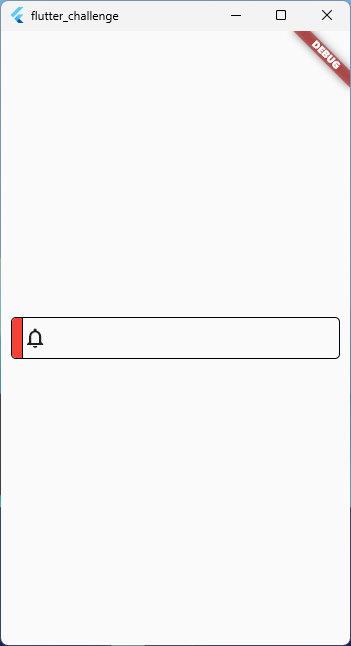

## Como iniciar
- [Download do Dart](https://dart.dev/get-dart)
Dart é a linguagem por trás do Flutter

- [Download do FVM](https://fvm.app/docs/getting_started/installation)
FVM é um gerenciador de versões do Flutter

## Sobre
Este é um projeto de desafio proposto por: [Rodrigo Rahman](https://github.com/rodrigorahman)

## Capturas de telas

 

 

   Feito com ❤️ by <a target="_blank" href="https://welitonsousa.github.io"><b>Weliton Sousa</b></a>

